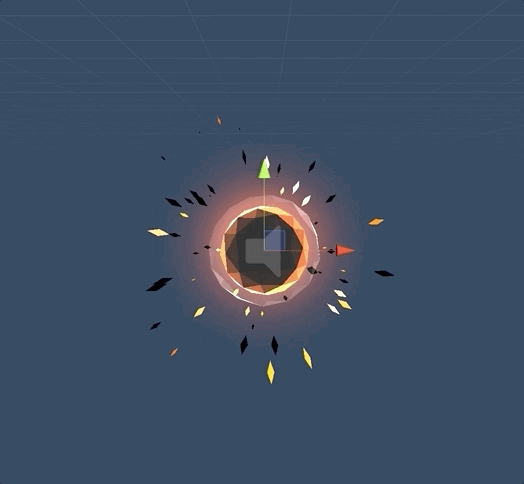

# Rocket Man
3D Touch-Screen, Skill Based Mobile Game 

## Gameplay
Based on real jet-pack / Rocket physics guide the Explorer through the treachery of the cosmos. 
Hunt and find ancient artifacts for your research. 

## Levels

Each planet has distinct behaviour, though the controls remain the same the planets have different physics and environments. 
There is a total of 9 planets to explore. 
* Desert
* Moon
* Jungle
* Ice
* Fire
* Glowing

## Controls
Touch the right hand side of the screen to initiate the astronauts boost. Touch the arrows to use the characters RCS thrust. 

## Technologies used
* C#
* UNITY 3D 
* Git

## Assets
Purchased on the [Unity Asset Store](https://assetstore.unity.com/).  

### Main Character
[Stylized Astronaut ](https://sketchfab.com/3d-models/stylized-astronaut-986714d296be4e7aae0adc53ce792012) by [NightSoundGames](https://www.nightsoundgames.com/) 

### Particle Effects
[Polygon Arsenal](https://www.youtube.com/watch?v=280kTK8Y3TU&feature=youtu.be) by [Kenneth Fidal Moe Archanor](https://archanor.com/) 

### Environment
[Synty Studios](https://syntystore.com/) 

## Environment
* macOS Mojave: 10.14.6
* VS Code: 1.39.1
* Unity 2019.1.10

## Contributing
If you wish the contribute to the final game please email [Me](bruce.pouncey@yahoo.com) with your ideas.

## Authors
* **Bruce Pouncey** - *Initial work* - [BPouncey](https://github.com/BPouncey)

## License
(MIT)

## Acknowledgments
[RED Academy](https://github.com/redacademy)

